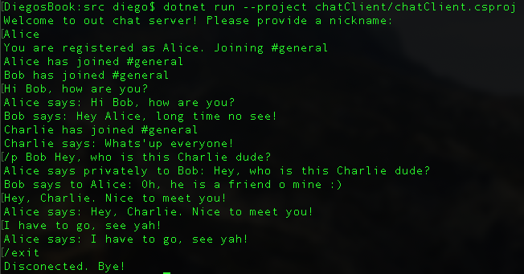

# Chat Service
A simple console chat service that allows the connection of multiple clients

## Table of Contents
* [Requirements](#requirements)
* [Setup](#setup)
* [Usage](#usage)
* [About](#about)

## Requirements

dotnet core CLI: https://dotnet.microsoft.com/download

## Setup

From the root directory:

- To run the server use the command: dotnet run --project chatServer/
- To run the client use the command: dotnet run --project chatClient/
- To run the unit tests use the command: dotnet test chatTest/chatTest.csproj

## Usage

Follow the instructions in the client terminal to login

Write a message to be broadcast to all users logged in the chat.

You can write the following commands:

- /p [user] [message]
    Writes a private message to a specific user

- /exit
    Logout from the chat

An example of a chat exchange:

## About 

Project developed using dotnet core version 5.0 and Visual Studio Code Version: 1.57.1 (Universal)